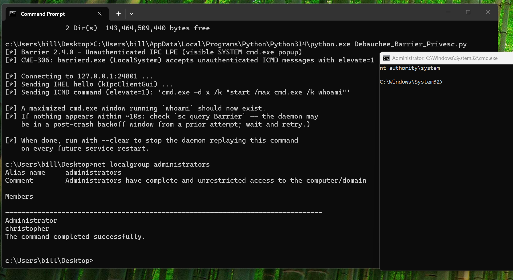

## Summary
<ins>**Vulnerability:**</ins> Unauthenticated IPC Local Privilege Escalation to SYSTEM via Barrier Daemon TCP Port 24801  
<ins>**Vendor:**</ins> debauchee (Barrier project)  
<ins>**Product:**</ins> Barrier 2.4.0 (final release, 2021-11-01)  
<ins>**CWE:**</ins> CWE-306: Missing Authentication for Critical Function

## Description

Barrier's Windows service (barrierd.exe), which is installed and runs as LocalSystem, binds a TCP IPC control server on 127.0.0.1:24801 with no authentication, no client identity verification, and no access control. Any local process, regardless of privilege level, can connect to this port and send a kIpcCommand ("ICMD") message containing an arbitrary command line and a 1-byte "elevate" flag. This duplicates the SYSTEM primary token of winlogon.exe and bang you have NT AUTHORITY\SYSTEM ran code. As the POC shows, you could also cause a new cmd.exe to pop-up Sthat runs as SYSTEM.

## Steps to Reproduce

1. Obtain low-privileged local code execution on a Windows host with the Barrier service (barrierd.exe, LocalSystem) installed and running.
2. Open a TCP connection to 127.0.0.1:24801.
3. Send the IPC hello: b"IHEL" + b"\x00" (identifies as kIpcClientGui).
4. Send the command message: b"ICMD" + struct.pack(">I", len(cmd)) + cmd.encode("utf-8") + b"\x01" (elevate=1), where cmd = "<payload> -d x /c <attacker command>" (for a one-shot command) or "<payload> -d x /k <attacker command>" (to avoid the daemon's watchdog relaunch loop if the payload itself does not keep a process alive, e.g. when using `start` to pop a visible window). The "-d x" prefix is REQUIRED to avoid crashing the daemon via the companion NULL-deref bug.
5. barrierd.exe's watchdog thread enumerates the active console session, opens winlogon.exe, and duplicates its SYSTEM primary token.
6. CreateProcessAsUser(systemToken, NULL, cmd, ...) spawns the attacker's command as NT AUTHORITY\SYSTEM -- cmd.exe's own lenient switch parser ignores the leading "-d x" noise and correctly honors "/c"/"/k" as "run remainder as command".
7. PERSISTENCE: the executed command is automatically saved and will re-execute as SYSTEM on every service restart/reboot with no further attacker action, until explicitly cleared by sending an empty command or editing HKLM\SOFTWARE\Barrier directly.

## Affected Code
* src/lib/ipc/IpcClientProxy.cpp - Command + elevate byte  
* src/lib/ipc/IpcServer.cpp -- No auth on the IPC accept path  
* src/lib/barrier/win32/DaemonApp.cpp -- Discards results and persists command to registry HKLM\SOFTWARE\Barrier  
* src/lib/platform/MSWindowsWatchdog.cpp -- SYSTEM token acquired  

Code: https://github.com/debauchee/barrier/releases/tag/v2.4.0

## Proof-of-Concept (POC) or go home
One Proof-of-Concept (POC) has been included to prove it's a thing.

[POC -- Debauchee_Barrier_Privesc.py](Debauchee_Barrier_Privesc.py)

## Impact

An attacker can exploit this vulnerability to gain SYSTEM-level privileges. Worse, the executed command will automatically fire on restart/start.

## Suggested Remediation

Barrier is unmaintained and will not receive a fix. For organizations still running Barrier, migrate to a patched build of Deskflow (the actively maintained successor) that addresses the same vulnerability in CVE-2026-41477 / GHSA-6rx5-g478-775c.

## Disclosure Timeline

- April 20, 2026 -- Discovered. It's Unmaintained and no one to report to.
- July 25, 2026 -- Decided it was worth reaching out to NoCVE as this project could potentially be forked.
