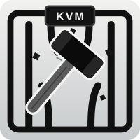
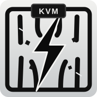

<div align="center">

### The KVM Escape Trilogy

<table>
<tr>
<td align="center" width="220">
<a href="https://github.com/V4bel/ITScape"></a>
<br><b><a href="https://github.com/V4bel/ITScape">ITScape</a></b>
<br><sub>(CVE&#8209;2026&#8209;46316)</sub>
</td>
<td align="center" width="220">
<a href="https://github.com/V4bel/Januscape"></a>
<br><b><a href="https://github.com/V4bel/Januscape">Januscape</a></b>
<br><sub>(CVE&#8209;2026&#8209;53359)</sub>
</td>
<td align="center" width="220">

<br><b>Zapscape</b>
<br><sub>(CVE&#8209;2026&#8209;64561)</sub>
</td>
</tr>
</table>

</div>

<br>

# Zapscape: Guest-to-Host Escape in KVM/x86

<p align="center">
  
</p>

# Abstract


This document describes the **Zapscape (CVE-2026-64561)** vulnerability discovered and reported by [Hyunwoo Kim (@v4bel)](https://x.com/v4bel). It is a KVM escape vulnerability that lets a guest escape to the host in a KVM/x86 environment and run commands on the host with kernel (root) privilege.

Zapscape is a use-after-free vulnerability in the **shadow MMU** emulation of KVM/x86, specifically in the recursive **zap** path that runs when shadow pages are reclaimed. It can trigger the bug with guest-side actions alone to corrupt the host kernel's shadow page, and it can threaten the guest-host isolation of KVM/x86 hosts that accept untrusted guests and expose nested virtualization, particularly multi-tenant x86 public clouds.

For the detailed technical information, [see here](assets/write-up.md).

> [!NOTE]
> After reporting this vulnerability to linux-distros@vs.openwall.org, the agreed embargo has ended, so the exploit is posted to oss-security and this Zapscape document is published. For the disclosure timeline, see the technical detail document.

# PoC Structure

The PoC is written to target AMD, and for safe testing, running it under QEMU TCG is recommended. The PoC has the following structure.

```
L0: Linux 7.1.3 + KVM_AMD on an x86_64 CPU (AMD SVM/NPT) emulated by QEMU TCG. The escape target
  └─ L1: the guest poc creates. Switching long -> PAE aliases one shadow page as both child and pinned root, and L1 then escalates the UAF into L0 kernel code-exec
       └─ L2: the guest L1 VMRUNs. Its memory touches trigger L0's quota reclaim -> recursive zap with no root_count guard -> UAF
```

This PoC is not a weaponized exploit that runs immediately in a cloud environment, but demonstration code that reproduces the vulnerability and the full exploit chain on top of QEMU TCG. To use it in a real cloud environment, the L1 actions the PoC performs must be moved into a guest kernel module, and the exploit must be ported to match the host kernel's kconfig. This is not a difficult task.

# PoC Usage

1. Download the vulnerable v7.1.3 kernel source, then build the kernel image based on the bundled kconfig.
2. Build the PoC, then compose a suitable initramfs using BusyBox or the like and put the built PoC into the initramfs.
```
# gcc -O2 -g -static -pthread poc.c -o poc
```

3. Boot the Linux 7.1.3 target with the following command. Test on QEMU v9.2.0 or later.
```
# ./qemu.sh bzImage initramfs.cpio.gz
```

4. After QEMU TCG boots, run the PoC. On a successful exploit, it escapes the guest and creates the /Zapscape file owned by root on the host.
```
 /$$$$$$$$  /$$$$$$  /$$$$$$$
|_____ $$  /$$__  $$| $$__  $$
     /$$/ | $$  \ $$| $$  \ $$
    /$$/  | $$$$$$$$| $$$$$$$/
   /$$/   | $$__  $$| $$____/
  /$$/    | $$  | $$| $$
 /$$$$$$$$| $$  | $$| $$
|________/|__/  |__/|__/

[+] /Zapscape created by the target KVM host kernel (owner uid=0, mode=0644).
[+] exploit completed - verify with: ls -la /Zapscape
zapscape(uid=65534)$ ls -la /Zapscape
-rw-r--r--    1 root     root             0 Jul 29 05:27 /Zapscape
zapscape(uid=65534)$
```
This PoC is intended to provide accurate information. Do not use it on systems you are not authorized to test.

# Affected Versions

Zapscape (CVE-2026-64561) covers the range from [f95eec9bed76 (2020-07-08)](https://git.kernel.org/pub/scm/linux/kernel/git/torvalds/linux.git/commit/?id=f95eec9bed76) to [2abd5287f083 (2026-07-21)](https://git.kernel.org/pub/scm/linux/kernel/git/torvalds/linux.git/commit/?id=2abd5287f083).

# FAQ

## What is the impact of this vulnerability?

The same as [Januscape (CVE-2026-53359)](https://github.com/V4bel/Januscape):

1. **KVM escape**: With guest-side actions alone, an attacker can compromise the host that runs their VM. For example, an attacker who has rented just a single instance on a public cloud could panic the host kernel to take down every other tenant VM on the same physical machine (DoS), or run code with root privilege on the host to take over the host and all the guests on it (RCE).
2. **LPE**: On distributions such as RHEL, `/dev/kvm` is world-writable (`0666`), so an unprivileged user can also use this vulnerability as an LPE to gain root. When it is used as an LPE, host-side VMM ioctls are available, so the exploit becomes easier and more stable.

## How is this related to Januscape?

It occurs in the same shadow MMU, but it is a separate vulnerability with a different root cause.

That said, unlike Januscape, on Intel it can be triggered only when both EPT page walk length 4 and 5 are exposed to L1. This is an important point when assessing the affected scope, so it must be understood precisely. See the technical detail document.

## Does this vulnerability occur in QEMU?

No. As with Januscape, it occurs in in-kernel KVM, so it is triggered independently of QEMU's emulation. Because of this, it can also threaten large public clouds that implement and use their own virtualization stack.

## Do I need root inside the guest VM?

Yes. L1 kernel privilege is required. When you are allocated an instance on a public cloud, you usually have root on your own VM, so this is satisfied. In a scenario without guest root, it must be chained with an LPE such as [Dirty Frag](https://github.com/V4bel/dirtyfrag).

## Do you think KVM vulnerabilities will keep appearing?

Yes. I recommend establishing a sustainable patching process for host hypervisors. *Winter is coming.*

## Are you planning a sequel after the trilogy?

I hope not.
